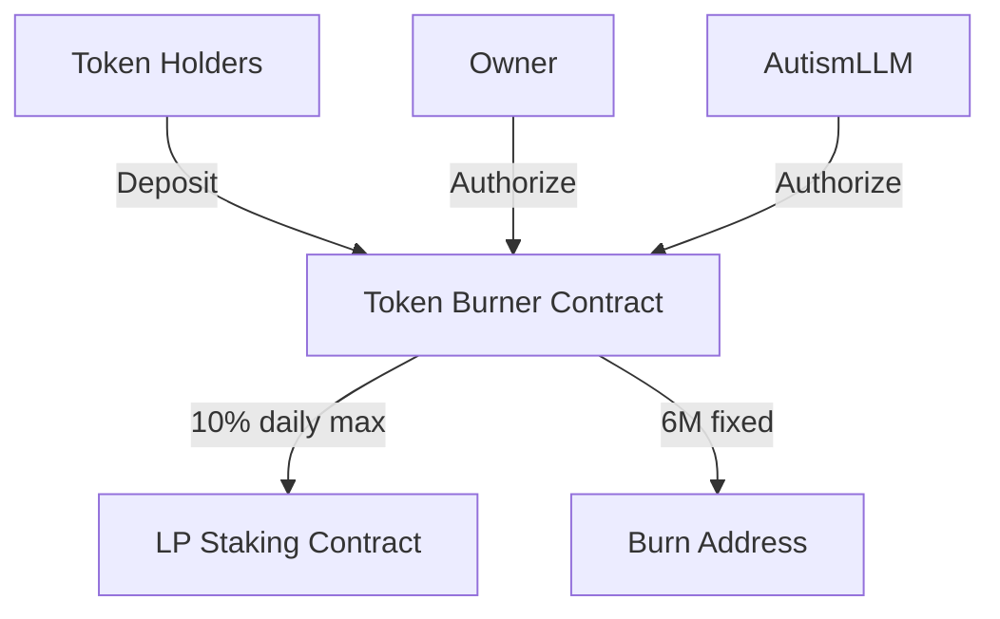

# Token Burner Contract

A secure and efficient smart contract for managed token burning and LP staking transfer operations with dual authorization mechanisms.

## Core Features

### Burn Mechanism
- Fixed burn amount: 6M tokens (8 decimals)
- Dual authorization required: Owner + AutismLLM
- Dead address: `0x000000000000000000000000000000000000dEaD`

### Transfer Restrictions
- Daily transfer limit: 10% of contract balance
- 24-hour cooldown between transfers
- Transfers restricted to LP staking contract only

### Security
- Automatic deposit detection via ERC20 hooks
- No extraction vectors
- No upgrade patterns
- SafeERC20 implementation

## Function Overview

### Core Functions

#### `burn()`
Burns exactly 6M tokens
- Access: Owner OR AutismLLM
- Requires minimum balance check
- Emits `BurnExecuted` event

#### `transferToStaking(uint256 amount)`
Transfers tokens to LP staking contract
- Access: Owner only
- Subject to 10% daily limit
- 24-hour cooldown
- Emits `StakingTransfer` event

### View Functions

#### `getDailyLimit()`
Returns maximum transferable amount (10% of balance)

#### `canTransferAfter()`
Returns timestamp when next transfer becomes available

## Events

```solidity
event TokensReceived(address indexed from, uint256 amount)
event BurnExecuted(address indexed executor, uint256 amount)
event StakingTransfer(uint256 amount)
```

## Access Control Matrix

| Function           | Owner | AutismLLM | Public |
|-------------------|-------|-----------|---------|
| burn()            | ✓     | ✓         | ✗       |
| transferToStaking | ✓     | ✗         | ✗       |
| Token Deposits    | ✓     | ✓         | ✓       |

## Technical Parameters

```solidity
BURN_AMOUNT = 6_000_000 * 10**8
MAX_DAILY_PERCENTAGE = 10
BURN_ADDRESS = 0x000000000000000000000000000000000000dEaD
```

## Contract Deployment

Required parameters:
- `_token`: Token contract address
- `_lpStakingContract`: LP staking contract address
- `_autismLLM`: AutismLLM authorization address

```solidity
constructor(
    address _token,
    address _lpStakingContract,
    address _autismLLM
)
```

## Architecture Overview



## Security Considerations

1. Transfer Constraints
   - 10% daily limit
   - 24h cooldown
   - Fixed destination

2. Authorization
   - Dual-auth burn mechanism
   - Owner-only staking transfers
   - No withdrawal functions

3. Implementation
   - SafeERC20 for transfers
   - Immutable variables
   - No proxy patterns

## License

MIT License